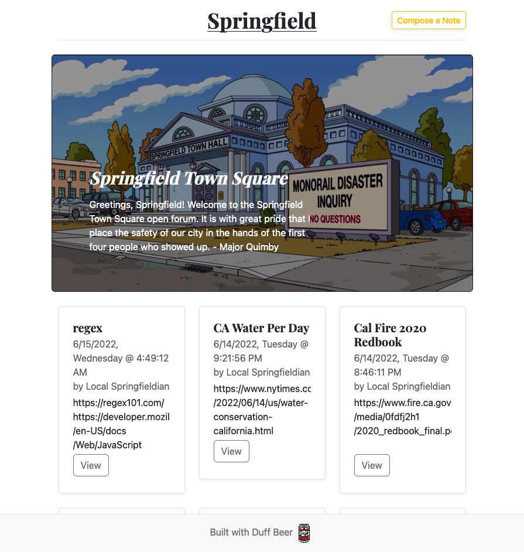
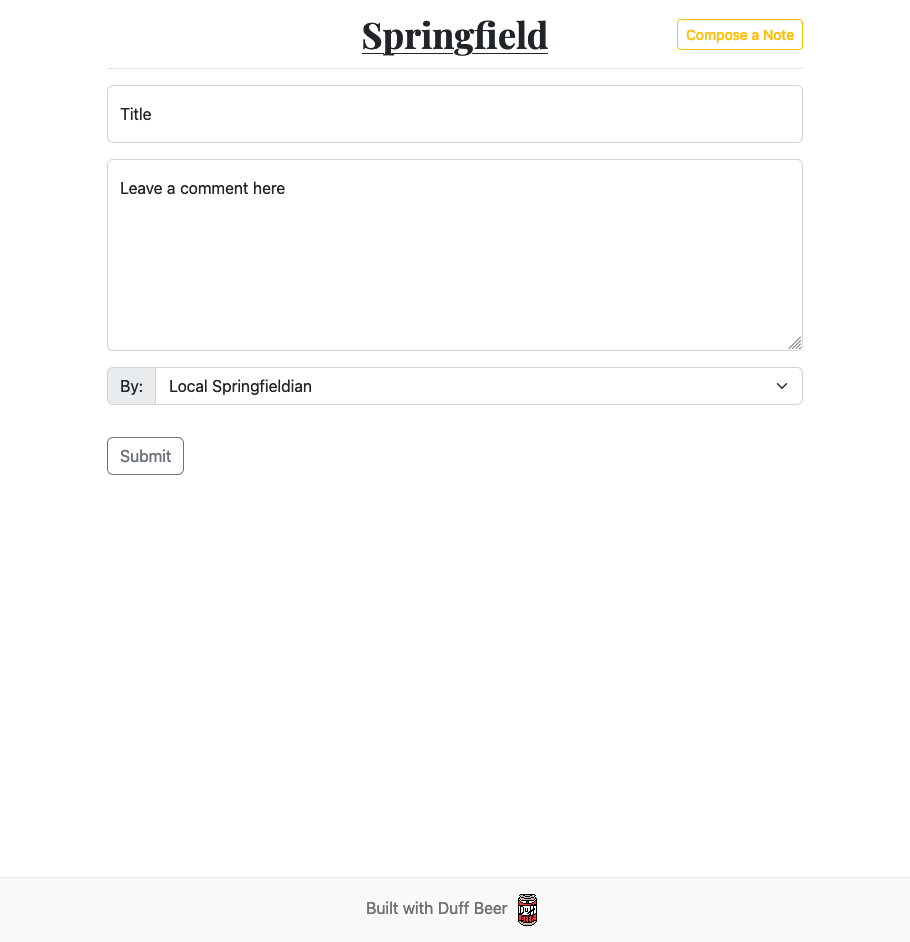
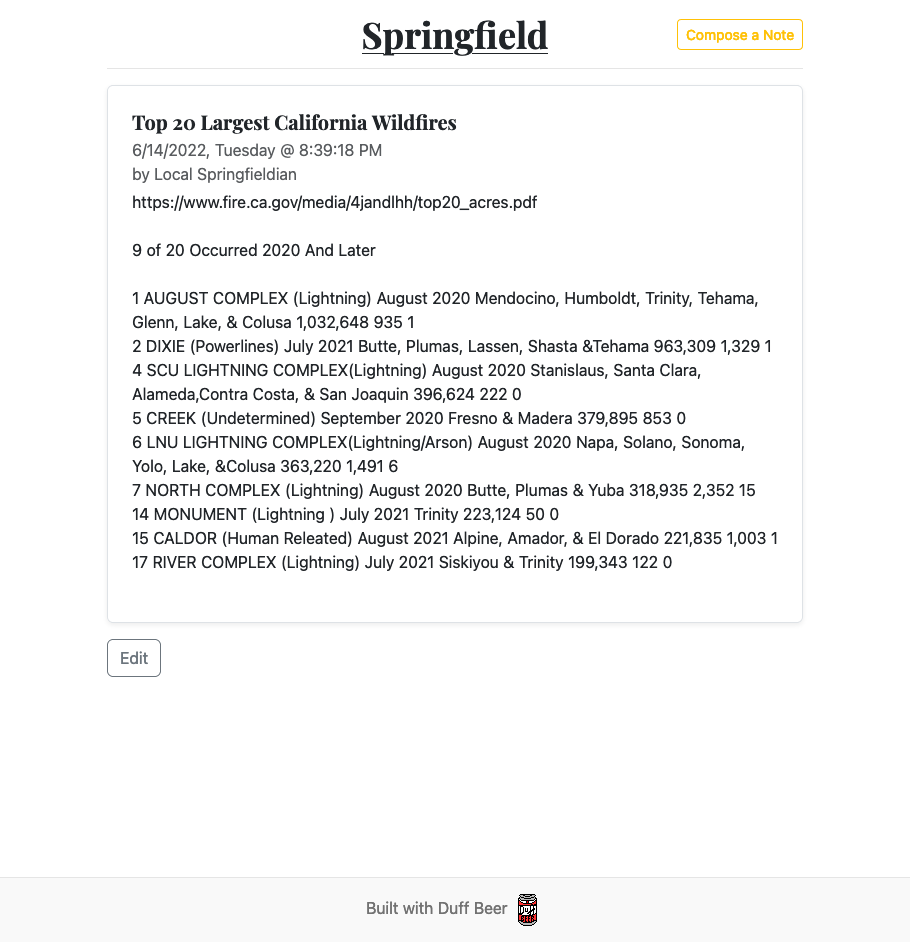

# blogDB

A 2022 one month project with Bootstrap5, Node.js, Express.js, ejs, MongoDB, and Mongoose.js. This is a blog database in the theme of the Simpsons. This project utilizes MongoDB for persistent data. Anyone is free to create a post. No sign up necessary. All post are public. Anyone can edit any post.

What things I learned and some tools used:
1) [Heroku](https://www.heroku.com)
2) [MongoDB](https://www.mongodb.com) & [MongoDB Altas](https://www.mongodb.com/atlas)
3) [Node.js](https://nodejs.org)
4) [Mongoose.js](https://mongoosejs.com/docs/guide.html)

## Home

## Compose a Note

## View and/or Edit Note

Express.js Hello World Example

` const express = require('express')
const app = express()
const port = 3000

app.get('/', (req, res) => {
  res.send('Hello World!')
})

app.listen(port, () => {
  console.log(`Example app listening on port ${port}`)
}) `
